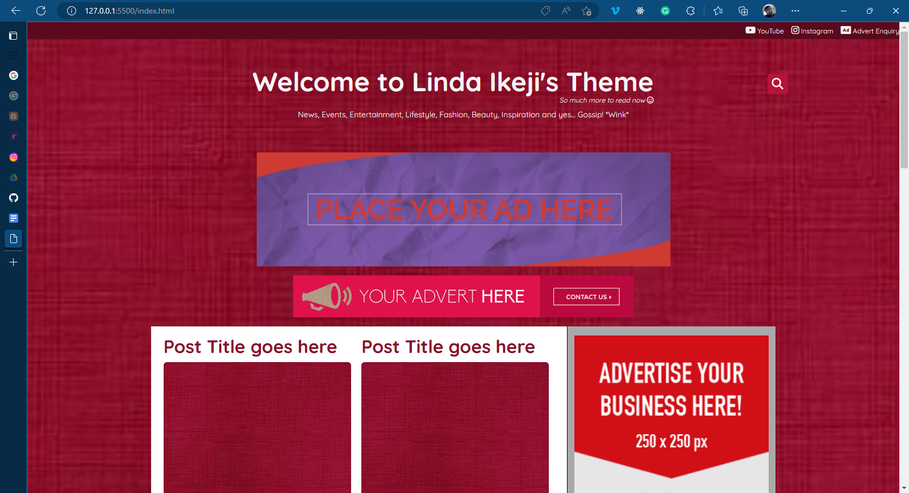

# Linda Ikeji's Blog HTML files

This the static files of the blog developed by Dapo Obembe from scratch. The WordPress version of the blog is a private repo and can be made available on request only.

See demo of the WordPress here: URL-TO-THE-BLOG

## Screenshot

 

## The Stacks used for this project

1.  HTML

2.  CSS

3.  Bootstrap

4.  Fontawesome (Quicksand is the font)

5.  Sharethis script (for Sharebutton)

6.  Few javascript code

## How to use for WordPress?

If you know how to convert this template to WordPress theme, go ahead but remember to reference me.

If you need the WordPress theme, contact me via dapo@alphawebconsult.com
